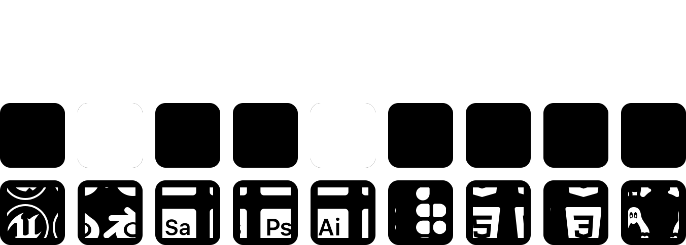

<b>Meu nome é Caique Matos, um desenvolvedor apaixonado por tecnologia. Meu foco principal é o desenvolvimento de jogos com Unreal Engine, mas, atualmente, tenho explorado a área de desenvolvimento web. Nos meus momentos livres, gosto de testar novas tecnologias, ler e escutar uma boa música.</b>

.NET • C++ • Python • Java • JavaScript • React • Ruby • Svelte • Vue.js

Java ☕ (Aprofundando conceitos com <i>Effective Java – Joshua Bloch</i>)

🎓 <i>Effective Java</i> – Joshua Bloch (Estudo)

🪓 <i>Chainsaw Man</i> – Tatsuki Fujimoto (Mangá)

❄️ <i>As Crônicas de Gelo e Fogo</i> – George R.R. Martin (Fantasia épica)

🤖 <i>Battle Angel Alita</i> – Yukito Kishiro (Cyberpunk)

🎮 *Moxter Game* – [Steam](https://store.steampowered.com/app/3217030/Moxter/) 

| Contato       | Link                      |
| ------------- | -------------------------- |
| 🎮 Discord    | [0flopper](https://discord.com/users/0flopper) |
| 📧 Email      | [caiquematos@proton.me](mailto:caiquematos@proton.me) |

